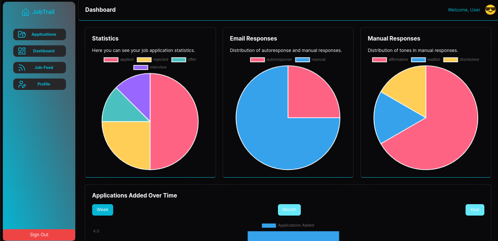

<!-- PROJECT LOGO -->
<br />
<div align="center">
  <a href="https://github.com/kibuchijw/jobtrail">
    
  </a>

  <h3 align="center">JobTrail</h3>

  <p align="center">
    An applications tracking webapp
    <br />
    <a href="https://drive.google.com/file/d/1BRGXCwXd5R13AwL70bCWVRRy4CVAXcY7/view?usp=sharing">View Demo</a>
    ·
    <a href="https://github.com/kibuchijw/jobtrail/issues/new?labels=bug&template=bug-report---.md">Report Bug</a>
    ·
    <a href="https://github.com/kibuchijw/jobtrail/issues/new?labels=enhancement&template=feature-request---.md">Request Feature</a>
  </p>
</div>

<!-- ABOUT THE PROJECT -->
## About The Project

<center></center>

<p align='center'>
In my days of freelancing, I once got a client whom I helped with a number of tasks as his virtual assistant. One such task was applying to jobs and filling in the job application details in a spreadsheet he had prepared. What intrigued me most, was how the email part would update dynamically, if the email was read, bounced or pending.Coming to the end of my software engineering journey, I feel empowered to build one such tool that achieves such functionality among a horde of others. This, I believe will help not only I, but the entire ALX community as we go into yet another phase of our lives. A phase of making job applications.
</p>

<p align="right">(<a href="#readme-top">back to top</a>)</p>


### Built With

This is a [Next.js](https://nextjs.org/) project bootstrapped with [`yarn create next-app`](https://github.com/vercel/next.js/tree/canary/packages/create-next-app).

## Getting Started
* Clone the repository 
``` link
git clone https://github.com/kibucjw/jobtrail
```
* Install dependencies

```bash
# Preffered
yarn
# or 
npm i
# or
```

* Run the development server:

```bash
# Preffered
yarn dev
# or
npm run dev
# or
pnpm dev
# or
bun dev

```

* Open [http://localhost:3000](http://localhost:3000) in your browser.

This project uses [`next/font`](https://nextjs.org/docs/basic-features/font-optimization) to automatically optimize and load Inter, a custom Google Font.

## Learn More

To learn more about Next.js, take a look at the following resources:

- [Next.js Documentation](https://nextjs.org/docs) - learn about Next.js features and API.
- [Learn Next.js](https://nextjs.org/learn) - an interactive Next.js tutorial.

You can check out [the Next.js GitHub repository](https://github.com/vercel/next.js/) as well

## Contributing

Contributins from the community are more that welcome! If you have suggestions or improvements, please follow these steps:

* Fork the repository.
* Create a new branch `git checkout -b feature/YourFeature`.
* Make your changes.
* Commit your changes `git commit -am 'Add new feature'`.
* Push to the branch `git push origin feature/YourFeature`.
* Open a Pull Request with a clear description of the changes.

## Reach Out
* [quxpta.tech](https://www.quxpta.tech)
* [twitter](https://x.com/QUxPTA)

## License
MIT © [Joseph Kibuchi](LICENSE.txt)
